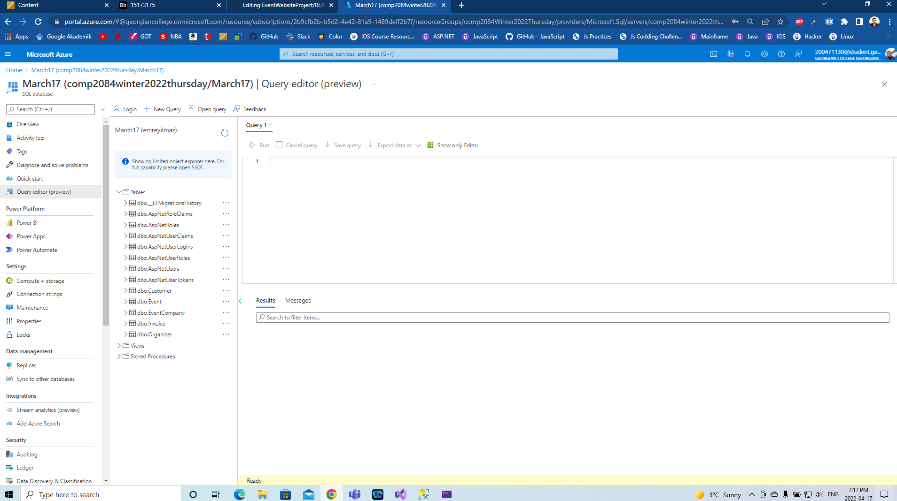
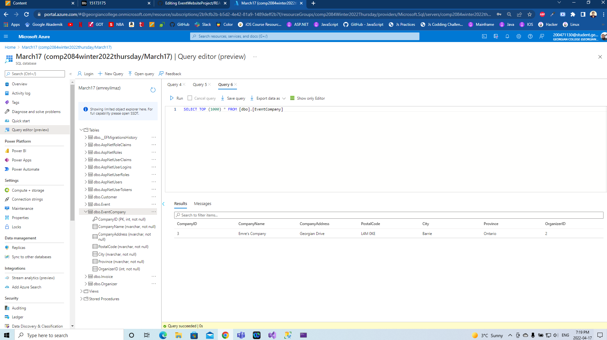
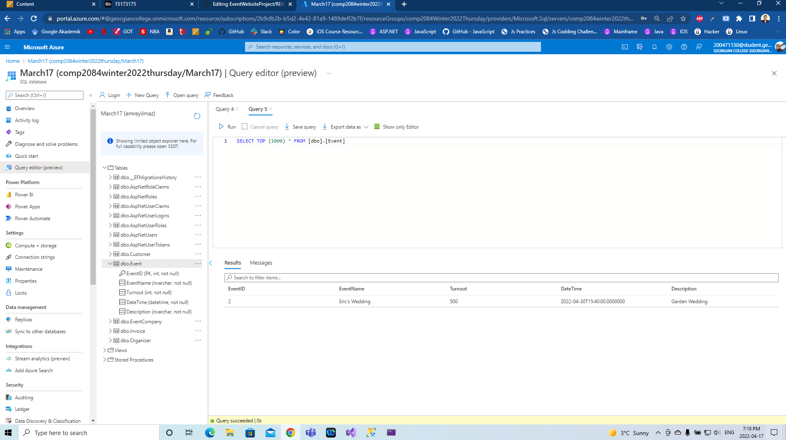
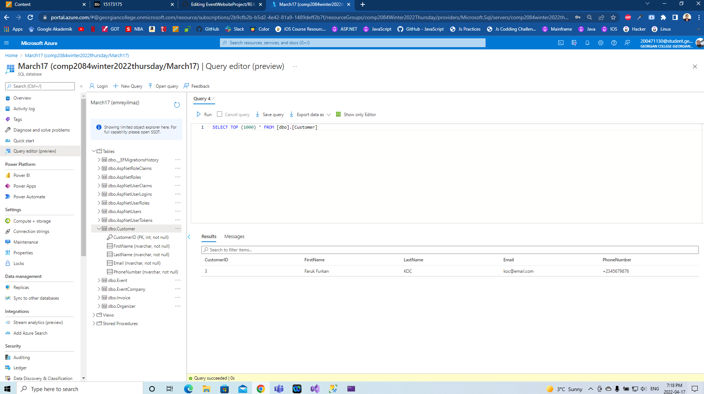
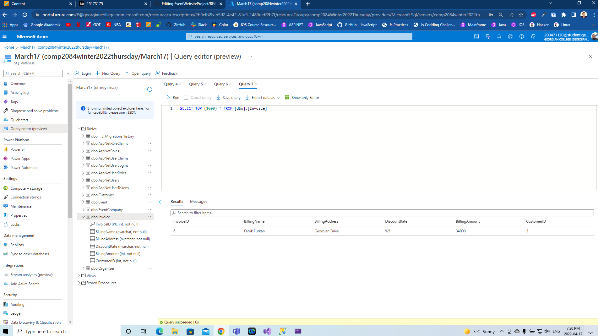

# EventWebsiteProject

# Authentication/Authorization
- As a general user who is just browsing, they can see the information about the company, but they cannot create, edit, or delete
- As a authorized user they can view all the menu options
- Whitout regestered or logged in the links are hidden except the Company page
- Only the Company page is accesible with some restrictions

# Database Screenshots

# Tables with Values

